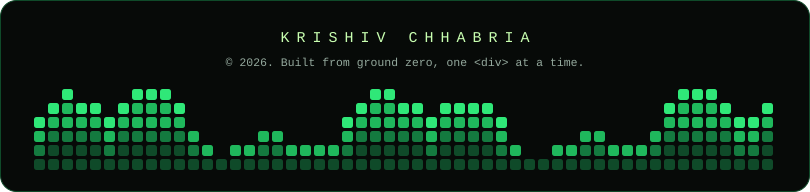

<div align="center">



<br/>


<br/>

[](https://github.com/kr1shivchhabria)

</div>

<br/><br/>

```diff
+ $ whoami
```

> Incoming CS student at **UC San Diego**, web developer, and builder — from Mumbai to San Diego.
> Currently debugging something right now. Probably.

<br/><br/>

<table align="center">
<tr>
<td width="50%" valign="top">

### ⚡ tech_stack.sh

<p>


</p>

### 🛰️ ways_of_working.log

<p>


</p>

</td>
<td width="50%" valign="top">

### 📡 status.json

```json
{
  "location": "San Diego, CA",
  "role": "CS Student @ UCSD",
  "focus": ["web dev", "systems", "MUN diplomacy"],
  "availability": "open to interesting problems",
  "fun_fact": "3x Certified Genius, Union Bank UGenius"
}
```

</td>
</tr>
</table>

<br/><br/><br/>

<div align="center">

### 📊 live_metrics.exe

<br/>

&emsp;&emsp;

</div>

<br/><br/><br/>

<div align="center">

### 🐍 contribution_grid.gif

<br/>

<picture>
  <source media="(prefers-color-scheme: dark)" srcset="https://raw.githubusercontent.com/kr1shivchhabria/kr1shivchhabria/output/github-contribution-grid-snake-dark.svg" />
  
</picture>

</div>

<br/><br/><br/>

<div align="center">

<br/>
<a href="mailto:krchhabria@ucsd.edu"></a><br/>
<br/>
<a href="https://www.linkedin.com/in/krishiv-chhabria-502628322/"></a><br/>
<a href="https://github.com/kr1shivchhabria/Personal-Resume"></a><br/>


<br/><br/><br/><br/>



</div>
